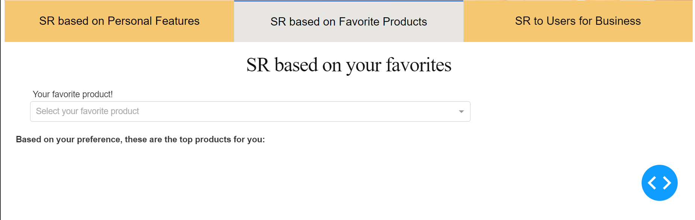

# Final Project of Special Problems in Computer Science INT3121 21
This project is a skincare recommendation system aimed at assisting users in finding personalized skincare products based on their specific needs and preferences. The system utilizes machine learning techniques to analyze user input and provide tailored recommendations, taking into account factors such as skin type, concerns, and desired outcomes. By leveraging a vast database of skincare products on [Sephora](https://www.sephora.com/) and [Amazon](https://www.amazon.com/) and knowledge, the system aims to enhance the skincare journey for individuals by offering informed and reliable suggestions.

## Skincare Recommendations

The Skincare recommendations has **three models**: 
- Model 1 is **based on user feature similarity**: Recommender that uses the customer features only to recommend the products

- Model 2 is a **content-based recommendations**: Recommends products using similarity between their ingredients

- Mode 3 is a **hybrid model** (using library [LightFM](https://arxiv.org/pdf/1507.08439)). This is best for business use: customer service represintatives can type in a unique user id and get a list of products recommended to that user, which, for example, can be emailed to that customer.

## Team Member
- [Khuong Vu Tram Anh](https://github.com/tramanh1511)
- [Tran Thi Tra Giang](https://github.com/kami2608)
- [Hoang Thi Thu Ha](https://github.com/thrillim)
 

